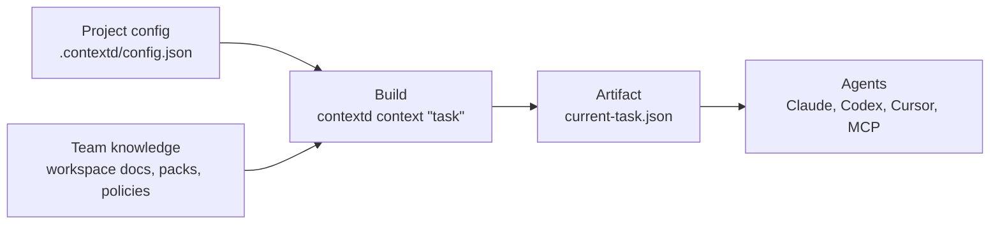

# contextd
**Build system for AI coding-agent context.**

contextd compiles workspace knowledge, packs, contracts, and policies into deterministic context artifacts for Claude, Codex, Cursor, and MCP.

## What contextd Does in One Task

contextd turns team knowledge into a build artifact an agent can actually consume:



The artifact records what was selected, what was dropped, what is missing, and which source hashes produced the result. `contextd explain` makes that build trace human-readable:

```text
$ contextd explain "prepare agent context for product requirements" --text
Workspace: default
Intent: review / product
Budget: 2/7 docs, ~2245 tokens

Selected Docs
- workspaces/default/platform/contracts/sub-agent-frontmatter-schema.md [contract]
- workspaces/default/platform/patterns/variant-discriminated-dispatcher.md [pattern]

Gaps
- (none)
```

For the same task, `--format json` includes selected and dropped docs, warning count, budget report, and `source_hashes` for reproducibility.


## Onboarding

> **Vietnamese:** [Onboarding (VI)](https://philngt.github.io/contextd/onboarding/index.html) · [Install Guide (VI)](https://philngt.github.io/contextd/onboarding/install.html)

> **English:** [Onboarding (EN)](https://philngt.github.io/contextd/onboarding/index.en.html) · [Install Guide (EN)](https://philngt.github.io/contextd/onboarding/install.en.html)

## Thesis (non-negotiables)

1. **Agent context is a build artifact**
   Team knowledge is source material; `contextd context` compiles the task-specific artifact consumed by agent adapters.

2. **Workspace isolation is mandatory**
   Retrieval and context generation are scoped to the active workspace for the current codebase.

3. **Packs are cognitive scaffolds, not just templates**  
   Packs are reusable reasoning modules that shape task framing, validation, and execution quality.

4. **Runtime-neutral core, adapter-specific surfaces**
   `.contextd/config.json` and the CLI are canonical. Claude Code slash commands, Codex skills, Cursor rules, and plain bundles consume the same workspace knowledge through adapters.

5. **Deterministic knowledge priority**  
   Contracts > Platform Patterns > Project Documentation > Domain Knowledge.

## Who This Is For

- Teams using AI coding agents across multiple projects/companies and needing strict workspace-level isolation.
- Engineers/tech leads who want reusable patterns + runtime adapters so agent output is consistent.
- Product/ops/domain teams who need structured knowledge that agents can execute against.
- Also useful for solo builders and platform/documentation owners who want repeatable AI-assisted workflows.

Not a good fit if you only need a static human-readable wiki without agent workflows.

## Project Status

This project is maintained on a **best-effort** basis.

- Community contributions are welcome
- If maintainer capacity changes, the project may move to maintenance mode or archive status

Use is provided under the repository license ([MIT](LICENSE)) and is offered **"AS IS"**, without warranty.

## Support & Compatibility

| Capability | Status |
|---|---|
| Claude Code slash commands | Stable |
| Claude Code subagents | Stable |
| Workspace/packs markdown engine | Stable |
| CLI: starter UX | Available (`contextd init`, `contextd check`, `contextd context`, `contextd explain`, `contextd find`) |
| CLI: advanced utilities | Available (`contextd resolve`, `contextd bundle`, `contextd export`) |
| CLI: deterministic task context | Available (`contextd context`) |
| CLI: diagnostics and selection explain | Available (`contextd doctor`, `contextd explain`) |
| CLI: governance and evaluation | Available (`contextd policy-check`, `contextd pack-validate`, `contextd eval --golden`) |
| Plain markdown bundle export | Available |
| Codex skill/plugin export | Available |
| Cursor rules export | Available |
| MCP stdio tools adapter | Available (`contextd mcp-server`) |

**System requirements**
- macOS/Linux: `bash` required.
- Windows: PowerShell + Git Bash or WSL recommended for shell installer execution.
- Write access to `~/.contextd/` for global config. Claude Code adapters still write to `~/.claude/`.
- Release binary installer prerequisites: `curl` or `wget` on macOS/Linux; PowerShell `Invoke-WebRequest` on Windows.
- Source/developer installs require Python >= 3.10 and Git.

**Trust and runtime model**
- Local-first: contextd reads local workspace knowledge and writes local context artifacts.
- No hosted service, API key, remote MCP transport, vector DB, or memory DB is required.
- Runtime remains stdlib-only; MCP support is a local stdio adapter, not an SDK dependency.
- Release binaries and installer scripts are published through GitHub Releases with `SHA256SUMS.txt`.

## Mental Model: Build Agent Context

contextd is a local build system for agent inputs:

1. **Start/check**: `contextd init`, `contextd check`
2. **Daily task artifact**: `contextd context "task" --preview`, with `contextd explain "task" --text` for selection trace
3. **Manifest index**: `.contextd/manifest.json`
4. **Runtime export/adapters**: `contextd connect`, plain markdown, Codex skill/plugin, Cursor rules, Claude Code artifacts, MCP stdio tools

Existing `.claude/commands` and `.claude/agents` remain supported adapters during the migration window, but `.contextd/config.json` is the canonical project config.

For the deeper model, see [docs/build-system-model.md](docs/build-system-model.md). It explains source inputs, build graph, artifact lifecycle, determinism boundaries, and common failure modes.

## Non-goals

- contextd is not a vector database.
- contextd is not a code graph indexer or AST/LSP analysis engine.
- MCP is optional. contextd does not require an MCP SDK, remote MCP server, or orchestrator runtime.
- contextd does not replace the coding agent; it builds scoped, auditable inputs for the agent.

## Works With Code Intelligence Tools

Tools such as code graph MCP servers help agents understand code structure: symbols, call paths, routes, dependencies, and blast radius. contextd solves a different layer: it makes agents use the right team knowledge, contracts, policies, workspace boundaries, and task-specific evidence.

Use them together when useful:

- Code intelligence answers "what does this codebase contain?"
- contextd answers "what rules, decisions, docs, and constraints should the agent use for this task?"

See [docs/comparison.md](docs/comparison.md) for positioning against MCP, code graph tools, Cursor rules, Claude memory, vector DBs, and knowledge bases.

## Repository Model

contextd = **build engine** (shared) + **N workspaces** (source knowledge) + **adapter outputs**.

```text
contextd/
├── agents/         ← ENGINE — system prompt, pipeline, coding rules (workspace-agnostic)
├── templates/      ← ENGINE — templates for new workspaces and docs
├── .contextd/      ← ENGINE — manifest/config/context runtime namespace
├── .claude/        ← ADAPTER — Claude Code slash commands
└── workspaces/     ← N workspaces, each with platform/domains/projects/... data
    └── {name}/...

# Active workspace is per-codebase, stored in <project>/.contextd/config.json.
```

### Compatibility: Legacy Adapters

Legacy `<project>/.claude/wiki.json` and `<project>/.Codex/wiki.json` are read as adapters during the migration window. They are not the source of truth.

## Packs (Stack-specific Knowledge)

Packs are stack/use-case knowledge layers between engine and workspace:

- Engine: shared, stack-agnostic rules and pipeline.
- Packs: stack-specific rules/patterns/contracts (web-api, event-driven, frontend, agentic, product, ...).
- Workspace: company/project-specific domain and implementation knowledge.

Enable packs via:

- Workspace default: `workspaces/{ws}/workspace.md` → `## Packs`
- Per-codebase override: `<cwd>/.contextd/config.json` → `packs` (replace semantics)

See [packs/README.md](packs/README.md) for the full catalog.

## Engine & Workspace Reference

- Engine folders: [agents/](agents/), [templates/](templates/), [.claude/commands/](.claude/commands/)
- Workspace structure and overrides: [workspaces/README.md](workspaces/README.md)

## How to Use

### First-time setup (run once)

**Short one-liners from GitHub Release assets** (generated per release tag):

```bash
curl -fsSL https://github.com/philngt/contextd/releases/latest/download/install.sh | sh
```

PowerShell (Windows):

```powershell
iwr https://github.com/philngt/contextd/releases/latest/download/install.ps1 -UseBasicParsing | iex
```

These install prebuilt `contextd` binaries from GitHub Releases. Users do not need to build the CLI locally.

### Install Matrix

| Platform | Release installer behavior |
|---|---|
| macOS arm64 | Installs `contextd-darwin-arm64`. |
| macOS x86_64 | Installs `contextd-darwin-x86_64`. |
| Linux x86_64 | Installs `contextd-linux-x86_64`. |
| Linux arm64 | No prebuilt binary yet; installer exits with source-install guidance. |
| Windows x86_64 | Installs `contextd-windows-x86_64.exe` via PowerShell. |
| Source checkout | `pip install -e .` works anywhere Python >= 3.10 is available. |

### Try the default demo in 2 minutes

The release installer installs the CLI. Clone this repo as a sample `knowledge_root` to try the bundled default workspace:

```bash
git clone https://github.com/philngt/contextd.git ~/contextd
cd ~/contextd
contextd init
contextd check
contextd context "prepare agent context for product requirements" --preview
contextd explain "prepare agent context for product requirements" --text
```

Expected signal: a clean check report, a `contextd_task_context.v1` artifact, focused selected docs, explicit gaps or `(none)`, a budget estimate, and source hashes in JSON output. Maintainers can run `contextd eval --golden --workspace default --text` when validating retrieval quality.

### Secure install (verify SHA256 before run)

```bash
TAG="vX.Y.Z"
BASE_URL="https://github.com/philngt/contextd/releases/download/${TAG}"
curl -fL -o install.sh "${BASE_URL}/install.sh"
curl -fL -o SHA256SUMS.txt "${BASE_URL}/SHA256SUMS.txt"
grep ' install.sh$' SHA256SUMS.txt | shasum -a 256 -c -
sh install.sh
```

PowerShell (Windows):

```powershell
$Tag = "vX.Y.Z"
$BaseUrl = "https://github.com/philngt/contextd/releases/download/$Tag"
Invoke-WebRequest "$BaseUrl/install.ps1" -OutFile "install.ps1"
Invoke-WebRequest "$BaseUrl/SHA256SUMS.txt" -OutFile "SHA256SUMS.txt"
$expected = (Select-String -Path .\SHA256SUMS.txt -Pattern ' install.ps1$').Line.Split(' ')[0].Trim()
$actual = (Get-FileHash .\install.ps1 -Algorithm SHA256).Hash.ToLower()
if ($actual -ne $expected.ToLower()) { throw "SHA256 mismatch for install.ps1" }
.\install.ps1
```

Developer/source checkout flow (for editing this repo or installing Claude adapters from a checkout):

```bash
pip install -e .
bash scripts/install-to-claude.sh --knowledge-root ~/contextd --default-workspace default
bash scripts/install-to-claude.sh --dry-run
bash scripts/install-to-claude.sh --force
```

If your workspaces live in a separate team repo:

```bash
bash scripts/install-to-claude.sh --knowledge-root ~/company-wiki --default-workspace shared
```

### Set up a codebase config

```bash
contextd init
contextd check
```

`contextd init` confirms an existing canonical config, migrates a local legacy `.claude/wiki.json` or `.Codex/wiki.json`, or creates a minimal config when the current directory already contains a `workspaces/` tree. For separate team knowledge repos, pass `--knowledge-root /path/to/contextd-or-team-knowledge-root --workspace {name}`.

### Start a session (inside a codebase)

```text
/list-workspaces
/switch-workspace {name}
```

Verify the runtime before asking an agent to work:

```bash
contextd check
```

### When you receive a task

```text
/use-contextd "Add Kafka consumer..."
```

Or with the runtime-neutral CLI:

```bash
contextd context "Add Kafka consumer..." --preview
contextd explain "Add Kafka consumer..." --text
contextd contract-path citation-format
```

`contextd context` emits the canonical JSON artifact. `contextd explain` shows why docs were selected or dropped, including gaps, warnings, source hashes, and the lightweight budget report.

See [docs/context-quality.md](docs/context-quality.md) for budget semantics, safety guard behavior, and rollout scorecards.
See [docs/effectiveness.md](docs/effectiveness.md) for measurable signals contextd can prove today without synthetic benchmark claims.

### Production Governance Loop

Use this loop before rolling contextd into a team workflow or after changing packs/workspace knowledge:

```bash
contextd doctor --json
contextd pack-validate --all --json
contextd context "debug context quality" --json --preview
contextd explain "debug context quality" --json
contextd policy-check "debug context quality" --json
contextd eval --golden --workspace default --json
```

- [docs/governance.md](docs/governance.md): policy-as-code over selected context.
- [docs/pack-validation.md](docs/pack-validation.md): pack API and retrieval-map validation.
- [docs/evaluation.md](docs/evaluation.md): golden-task evaluation for context selection quality.
- [docs/effectiveness.md](docs/effectiveness.md): adoption metrics and proof signals.
- [docs/build-system-model.md](docs/build-system-model.md): deeper product and artifact model.

### MCP Adapter

Run contextd as a local stdio MCP tools server:

```bash
contextd connect --client codex --knowledge-root ~/contextd --workspace default
contextd connect --client all --knowledge-root ~/company-wiki --workspace shared
```

See [docs/mcp.md](docs/mcp.md) for Claude, Cursor, Codex snippets, security notes, tools, resources, and prompts.

### After coding

```text
/update-contextd
/rebase-contextd
```

### Create a new workspace

```text
/new-workspace {name}
```

## Codex Usage

contextd can also be used with OpenAI Codex CLI via the exported skill or MCP adapter.

1. Install the `contextd` CLI with the release binary installer above. For source checkout development only:
   ```bash
   pip install -e .
   ```
2. Install the Codex skill from the CLI:
   ```bash
   contextd export --runtime codex-plugin --install
   ```
   If you are working from this source checkout, the helper script is equivalent:
   ```bash
   bash scripts/setup-codex-skills.sh
   ```
3. In any project with `.contextd/config.json`, Codex can now use contextd:
   ```bash
   codex 'Run contextd resolve and find the relevant contract for this task'
   ```

## Deploy GitHub Pages

Workflow: [deploy-pages.yml](.github/workflows/deploy-pages.yml)

- Trigger:
  - `push` to `main` when `onboarding/**` changes
  - manual `workflow_dispatch`
- Build flow:
  1. `bash scripts/package-release.sh`
  2. collect `onboarding/` and `release/`
  3. deploy to `github-pages`

## Release

Workflow: [release.yml](.github/workflows/release.yml)

- Trigger:
  - semver tag push `v*.*.*`
  - manual `workflow_dispatch`
- Flow: package release artifacts, then publish GitHub Release assets.

## Troubleshooting

- Slash commands not visible: re-run `bash scripts/install-to-claude.sh` and restart Claude Code.
- Missing `.contextd/config.json`: run `contextd init`; for legacy-only projects it delegates to `contextd migrate-config`.
- Wrong workspace context: verify `workspace` in `<cwd>/.contextd/config.json`; legacy adapters are lower priority during migration.

## Contributing

See [CONTRIBUTING.md](CONTRIBUTING.md).

## License

[MIT](LICENSE)
