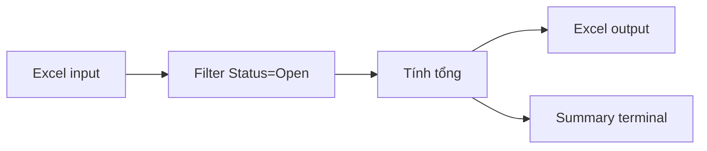

# {Tool title}

## Problem

{Mô tả pain point đời thực, 1-2 đoạn:
- Hiện tại bạn làm tay/Excel mất bao lâu?
- Vấn đề chính là gì? (chậm? dễ sai? lặp lại nhàm chán? cần share?)
- Quantify nếu được: "30 phút mỗi lần × 5 lần/tuần = 2.5h/tuần"}

## System Map

### Plain text

```
Input: {ví dụ: file Excel ABC.xlsx export từ phần mềm kế toán}
   ↓
Process: {ví dụ: filter dòng có Status="Open" + tính tổng cột Amount}
   ↓
Output: {ví dụ: file Excel ABC-filtered.xlsx + in summary terminal}
```

### Mermaid



## Tech Stack

**Recipe used**: [{recipe-name}](packs/pack-solo-builder/recipes/{recipe-name}.md)

| Component | Chọn | Vì sao chọn | Vì sao KHÔNG alternative |
|-----------|------|-------------|--------------------------|
| Language | {Python/Node/...} | {1 câu plain language} | {1 câu lý do} |
| Framework / Library | {tên + 1-line explain} | {lý do} | {lý do} |
| Storage | {SQLite / file / API / ...} | {lý do} | {lý do} |
| UI | {CLI / GUI / web} | {lý do} | {lý do} |

## Setup

### Linux / macOS

```bash
{commands cụ thể}
```

### Windows native (nếu áp dụng được)

```powershell
{commands cụ thể}
```

### Windows + Docker (recommend nếu deps phức tạp)

```yaml
# docker-compose.yml
{config}
```

```bash
docker compose run --rm tool
```

## Acceptance Criteria

- [ ] {When user runs `python tool.py input.xlsx`, output file `input-filtered.xlsx` is created}
- [ ] {Output file contains exactly N rows where N = số dòng có Status="Open"}
- [ ] {Terminal prints summary: "Filtered N rows from M total"}
- [ ] {Setup instructions work on Windows with Docker (đã test thực tế)}
- [ ] {Setup instructions work on Linux native (đã test thực tế)}

> KHÔNG dùng "hoạt động tốt" / "dễ dùng" — phải testable.

## Open Questions

- {Câu chưa rõ trong discovery — cần user trả lời sau}
- {Edge case chưa xử lý}

## Build Log

> Section này fill khi `status: building`. Mỗi milestone 1 entry.

- YYYY-MM-DD: {milestone description}

## Related

- Recipe: [{recipe-name}](../../packs/pack-solo-builder/recipes/{recipe-name}.md)
- Tools đã có liên quan: {link tools tương tự nếu có trong `{ws}/tools/`}
- Domain glossary: {link `{ws}/domains/{field}/glossary.md` nếu dùng term ngành}
